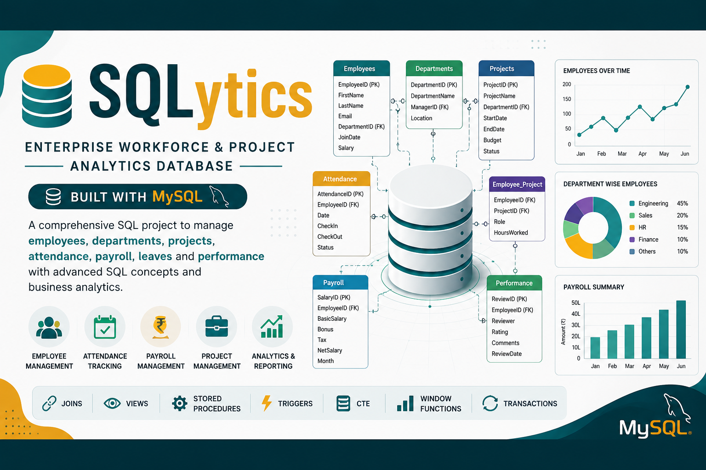

```markdown
<div align="center">

# 🚀 SQLytics
### Enterprise Workforce & Project Analytics Database

<p align="center">
  
</p>


**An enterprise-level MySQL database project for managing employees, departments, attendance, payroll, projects, and business analytics using advanced SQL concepts.**

---

</div>

## 📌 Overview

SQLytics is a real-world database management system built using **MySQL**. It simulates an enterprise workforce environment by managing employees, projects, payroll, attendance, leaves, and performance while demonstrating advanced SQL techniques.

---

## ✨ Features

- 👨‍💼 Employee Management
- 🏢 Department Management
- 📁 Project Management
- 📅 Attendance Tracking
- 💰 Payroll Management
- 📝 Leave Management
- ⭐ Performance Reviews
- 📊 Business Analytics
- 📈 Reporting Dashboard

---

## 🛠 Tech Stack

| Technology | Usage |
|------------|-------|
| MySQL | Database |
| SQL | Queries |
| MySQL Workbench | Database Design |
| Git | Version Control |
| GitHub | Repository Hosting |

---

## 🗂 Database Modules

- Employees
- Departments
- Projects
- Employee_Project
- Attendance
- Payroll
- Leave
- Performance Reviews

---

## 🧠 SQL Concepts Covered

- Primary Keys
- Foreign Keys
- Constraints
- Joins
- GROUP BY & HAVING
- Aggregate Functions
- Views
- Stored Procedures
- Functions
- Triggers
- Common Table Expressions (CTEs)
- Window Functions
- Transactions
- Indexing

---

## 📊 Analytics Reports

- Employee Summary
- Department-wise Employees
- Attendance Report
- Payroll Summary
- Leave Statistics
- Performance Ranking
- Project Budget Analysis
- Monthly Business Reports

---

## 📁 Project Structure

```

SQLytics
│
├── assets/
│   ├── banner.png
│   ├── dashboard.png
│   └── er-diagram.png
│
├── database/
│   ├── create_database.sql
│   ├── create_tables.sql
│   ├── constraints.sql
│   └── indexes.sql
│
├── data/
│   ├── sample_data.sql
│   ├── employees.sql
│   ├── departments.sql
│   ├── attendance.sql
│   └── payroll.sql
│
├── queries/
│   ├── basic_queries.sql
│   ├── joins.sql
│   ├── cte.sql
│   ├── window_functions.sql
│   └── reports.sql
│
├── procedures/
│   ├── procedures.sql
│   ├── functions.sql
│   └── triggers.sql
│
├── README.md
└── LICENSE

````

---

## 🖼 Screenshots

### Dashboard

```markdown

````

### ER Diagram

```markdown

```

---

## 🚀 Getting Started

### Clone Repository

```bash
git clone https://github.com/your-username/SQLytics.git
```

### Import Database

1. Open **MySQL Workbench**
2. Create a new database
3. Execute all SQL files in order:

   * `create_database.sql`
   * `create_tables.sql`
   * `constraints.sql`
   * `sample_data.sql`

---

## 📈 Future Improvements

* Web Dashboard
* Authentication
* REST API Integration
* Data Visualization
* Export Reports (PDF/Excel)
* Role-Based Access Control

---

## 🤝 Contributing

Contributions are welcome! Feel free to fork the repository, improve features, and submit pull requests.

---

## 📜 License

This project is licensed under the **MIT License**.

---

<div align="center">

### ⭐ If you found this project useful, don't forget to star the repository!

**Made with ❤️ using MySQL & SQL**

</div>
```
